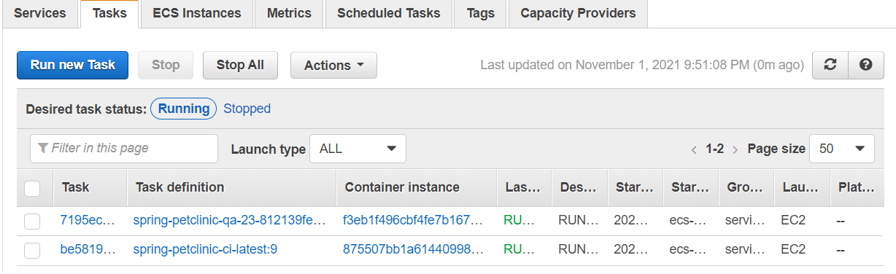

## CI/CD project for [spring-petclinic web-app](https://github.com/InfraMarine/spring-petclinic.git)
Using Terraform, Ansible, Jenkins serverless, Docker, AWS cloud provider.

This project is created for educational pusposes. It exemplifies creating simple CI/CD process for Java (Spring) web app. 
As such in terms of cloud infrastructure project is built to be as cheap as possible (under AWS Free Tier). [Detailed](./terraform-jenkins-cloud). 

AWS cloud [deploy](./terraform-deploy-env) and [CI/CD orchestration](./terraform-jenkins-cloud) resources are defined in two separate Terraform projects for ease of management. Latter - [terraform-jenkins-cloud](./terraform-jenkins-cloud) with Terraform code for Jenkins serverless cloud has it's own README.md, as it is significant part of the project.

#### Workflow:
- Upon commit to the app repository GitHub Webhook triggers [Jenkins pipeline job](https://github.com/InfraMarine/spring-petclinic/blob/main/Jenkinsfile), which:
  - checkouts SCM (GitHub) to a Workspace
  - builds JAR file from source
  - from JAR file builds Docker image and tags it with Jenkins build id and git commit hash
  - pushes Docker image to ECR (artifact storage)
  - triggers CI deploy pipeline, which executes __Ansible CI deploy playbook__
- Ansible deploy playbooks create ecs task definition and ecs service given for given image tag, but:
  - __[CI playbook](./ansible/deploy-service-ci.yml)__ updates existing service and task definition both named _petclinic-ci-latest_
  - [QA playbook](./ansible/deploy-service-qa.yml) creates new resources with image tag embedded in their names
- Deployed app is accessible on port _8080_ and IP is of a container that runs app (obtained by AWS ECS service in GUI), as load balancer is not created for deploy job. 
This container IP is known only after defined service deployment which can take minutes and deploy job currently doesn't wait to obtain this info.

[Jenkins deployment job for QA](./ansible/deploy_QA.jenkinsfile) environment to be triggered manually with provided _image tag_ among other job params.

QA and CI deployments are very similar and deployed to same ECS cluster for the sake of simplicity.

Deployed CI task and one QA task:

To work with AWS cloud Ansible uses collection [Community.Aws](https://docs.ansible.com/ansible/latest/collections/community/aws/index.html) with [Amazon.Aws](https://docs.ansible.com/ansible/latest/collections/amazon/aws/index.html) also included in requirements but not used (to obtain VPC info) :sweat_smile:

[Dockerfile for app](https://github.com/InfraMarine/spring-petclinic/blob/main/Dockerfile) and [Jenkinsfile for build/push job](https://github.com/InfraMarine/spring-petclinic/blob/main/Jenkinsfile) are located in spring-petclinic app repository, while other Jenkinsfiles and IaC files are located here.

Jenkins master task uses [custom image](https://hub.docker.com/repository/docker/medoth/jenkins-ansible) derived from _jenkins/jenkins_ with _Ansible_ installed.

### Usage

This project can be usefull as an CI/CD exemple and must be customised for other tasks. But its submodules as Terraform code for serverless Jenkins or asg for ecs
can be used on it's own with little to none customisation. Nevertheless:

1. Clone this repository (fork and clone) using `git clone`
2. Create `terraform.tfvars` files in _terraform-jenkins-cloud_ and _terraform-deploy-env_ folders and specify variables defined in corresponding
_variables.tf_ files
3. Check AWS SSH keypairs definitions as they expect _.pem_ files with specific names in folder _.ssh/_ in project root
4. Run `terraform apply` in both Terraform folders
5. Jenkins server will be available by URL of a load balancer
6. Install required plugins listed below
7. Add your credentials (AWS, GitHub) and create Webhook for GitHub app repository (in repo's page _Settings_ > _Webhooks_):
    - specify Jenkins master url with `/github-webhook/` in the end :exclamation:
    - in secret field should be [API token of a Jenkins user](https://stackoverflow.com/questions/45466090/how-to-get-the-api-token-for-jenkins) (recommended practice is to create a new user e.g. _git_user_)
> In build/push job select _GitHub hook trigger for GITScm polling_ in _Build Triggers_
9. Proceed with steps provided by [Tom Gregory tutorial](https://tomgregory.com/jenkins-jobs-in-aws-ecs-with-slave-agents/) to create agents cloud in Jenkins. There already is one task definition but you can add your own via GUI or create custom task definition
> CI Deploy job name (petclinic-deploy-ci) is hard coded in Jenkinsfile for build/push job 

### Project specific Jenkins plugins:
- [Amazon Elastic Container Service (ECS) / Fargate plugin](https://plugins.jenkins.io/amazon-ecs/)
- [Ansible plugin](https://plugins.jenkins.io/ansible)
- [Pipeline: AWS Steps](https://plugins.jenkins.io/pipeline-aws)
- [Docker Pipeline](https://plugins.jenkins.io/docker-workflow)

Along with common plugins: *Pipeline, Credentials Plugin, Git, GitHub plugin, CloudBees AWS Credentials Plugin, Credentials Binding Plugin*

## Credits:
- [Tom Gregory guides on setting up Jenkins cloud in ECS with Jenkins](https://tomgregory.com/deploy-jenkins-into-aws-ecs/)
- source code from https://aws.amazon.com/blogs/devops/building-a-serverless-jenkins-environment-on-aws-fargate/ helped to clarify alot with Terraform

