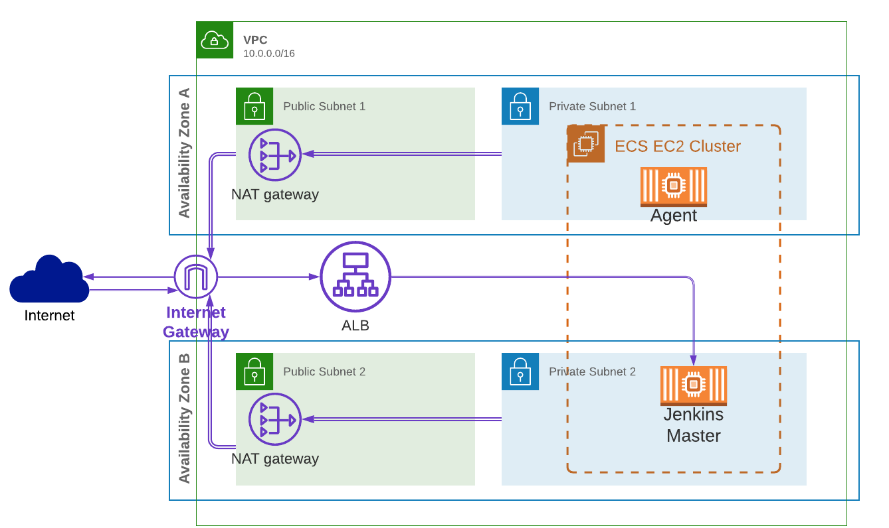
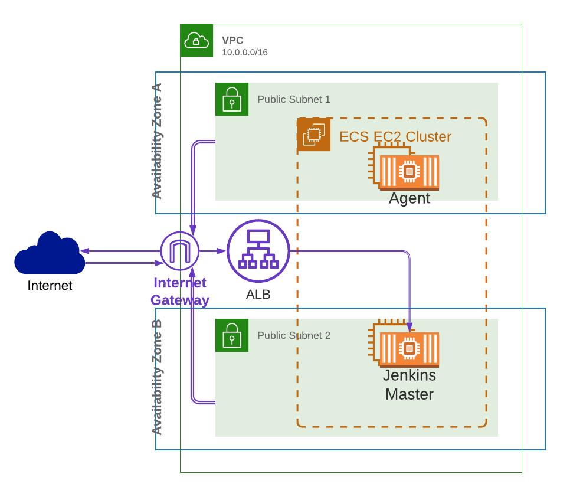

## Jenkins ECS cloud

Jenskins master runs as ECS Service and uses Jenkins plugin [Amazon Elastic Container Service (ECS) / Fargate](https://plugins.jenkins.io/amazon-ecs/) to run temporary agents 
in the same ECS cluster. Used [Tom Gregory tutorial](https://tomgregory.com/deploy-jenkins-into-aws-ecs/).

#### Data Preservation

EFS volume attached to Jenkins home dir (`/var/jenkis_home`) which allows to preserve all Jenkins master data when ECS task is redeployed.

For jenkins inbound agents EFS volume is attached to `jenkins` user home dir for preservtion of installed dependancies by _Maven_. Same EFS resource is used with no reason.

#### Pros:
- Jenkins infrastructure is fully disposable, with easy replacement of Jenkins master when something in container breaks
- No need for installing Jenkins by hand or orchestration tools
- No resource using by agents when idle as they are disposed of
#### Cons: 
- Installing new features (awscli) to master requires rebuilding Docker image
- When memory usage by container is near 100% then it is automatically killed and replacement of master takes minutes. 
This happened to me when running ansible playbooks on master very often until I increased memory reservation, 
as it seems tasks is still killed if no hard limit is set and it uses not full container memory but exceeds defined `memoryReservation`.
- Jobs take additional time when agent container and probably instance are being provisioned.

### ECS cluster architecture choice

ECS task can use network modes:
- `awsvpc` (Elastic Network Interface attached to container) network mode wich allows attaching security group to task, registering in private DNS zone, 
assigning public IP address when lauch type is `FARGATE`, but not when `EC2`
- `bridge`, `host` - task uses host machine network interface, hence security group is to be assigned to instance, no more than one task can use same port on host machine (which is no problem as t3.micro with only 1GB RAM was used as instance type)

ECS cluster can use next providers:
- autoscaling group with EC2 instances - no cost under _Free Tier_ with `t3.micro` instance type
- [Fargate](https://aws.amazon.com/fargate/pricing/)

Why do we need public IP? It is reccomended to deploy EC2 instances and ECS tasks to private subnets, then use NAT gateway to give outbound access to Internet, 
but AWS NAT Gateway costs more than 1 Fargate virtual CPU per hour, and for project with no economic value is a burden.

With `bridge` task's network security group applies to all instances in autoscaling group. This forces to change infrastructure (sg for asg) if we change app port or app itself, and is inconvenient as different apps (e.g. Jenkins master and Jenkins inbound agent) need different security rules. But still `bridge` + `EC2` with public IP is free.

In this project `EC2` lauch type with `bridge` network mode was used, which allowed to use public IP with tasks and avoid using NAT gateway. Using Fargate spot (~0.01 USD/hour) would be better for simulating real world situation and would made the project production ready.

_Architecture_: 
- ECS cluster with EC2 asg with NAT:

- Current:

